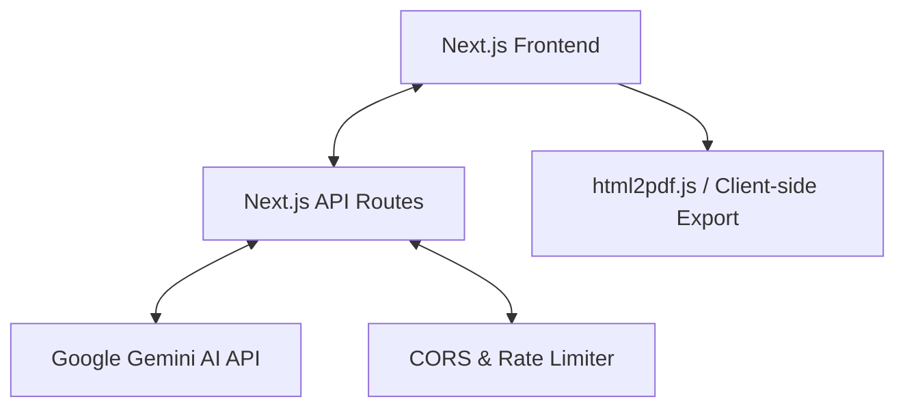
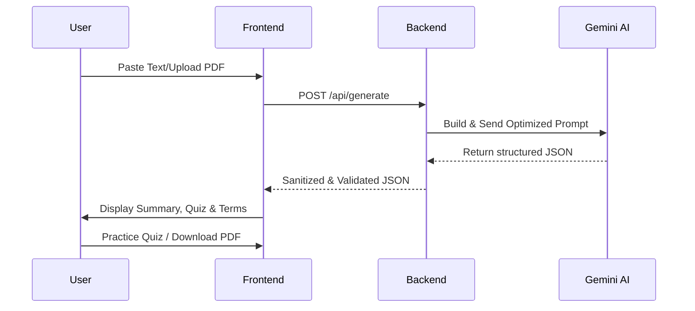

# StudySnap ✨

AI-powered study guides and practice quizzes generated in seconds.

---

## 1. Project Overview & Identity

**Team StudySnap:**
- Swayam Garg
- [Team Member 2]
- [Team Member 3]

### Problem Statement
**Focus: WD-04 / FT-02 (Personalized Education & Knowledge Synthesis)**

Students and professionals often face "information overload" when processing long lecture notes, research papers, or textbooks. There is a lack of efficient, automated tools to synthesize this information into bite-sized summaries and self-assessment tools without requiring manual effort. StudySnap solves this by leveraging LLMs to instantly transform raw text into organized study materials.

### Methodology/Approach
Our approach focuses on **Knowledge Extraction & Active Recall**:
- **Why LLMs?** We use the Gemini 1.5 Flash model for its large context window and high-speed inference, making it ideal for processing long study documents.
- **Why Active Recall?** Scientific research shows that testing yourself (quizzing) is more effective than passive reading. StudySnap automates quiz generation to foster this learning pattern.
- **Design Pattern:** We implemented a modular component-based architecture for the frontend and a stateless RESTful API on the backend for scalability.

---

## 2. Technical Architecture & Documentation

### Architecture Diagram


### User Flow Diagram


### Database Schema (ERD)
*Note: Current version of StudySnap is stateless to prioritize speed and user privacy. No user data is stored persistently.*

- **Data Structure (Session State):**
  - `inputText`: String (up to 4,000 words)
  - `difficulty`: Enum ("Easy", "Medium", "Hard")
  - `StudyResult`: Object { summary: string, key_terms: Array, quiz: Array }

### Logic Explanations
**Prompt Injection Prevention & Formatting:**
We use a **System Prompting** technique to ensure the AI output is always valid JSON. 
Logic: 
1. Word count validation: `inputText.split(/\s+/).length <= 4000`.
2. Markdown Stripping: `response.replace(/^```json/, '').replace(/```$/, '')` to ensure `JSON.parse()` success.

---

## 3. Setup & Installation Instructions

### Installation Steps
1. Clone the repository:
   ```bash
   git clone https://github.com/Swayam7Garg/Study-Snap.git
   cd Study-Snap
   ```
2. Install dependencies:
   ```bash
   npm install
   ```
3. Copy the environment template:
   ```bash
   cp .env.example .env.local
   ```
4. Start the development server:
   ```bash
   npm run dev
   ```

### Environment Configuration
- `GEMINI_API_KEY`: Your API key from [Google AI Studio](https://aistudio.google.com/).

### Folder Structure
```bash
├── app/              # Next.js App Router (Pages & API)
│   ├── api/          # Backend API endpoints
│   └── globals.css   # Tailwind configuration
├── components/       # Reusable UI components (Quiz, Summary, etc.)
├── lib/              # Core logic & AI initialization
├── prompts/          # Documented Prompt Templates
├── public/           # Static assets & screenshots
└── middleware.ts     # CORS & Rate limiting
```

---

## 4. Domain-Specific Requirements (AI/ML)

### Model Card
- **Model Used:** `gemini-1.5-flash-latest`
- **Provider:** Google Generative AI
- **Temperature:** 0.3 (Optimized for balance between creativity and accuracy)
- **TopK / TopP:** 1 / 0.95

### Documented Prompt Template
Located in `prompts/study-prompt.ts`.
> "Act as an expert study assistant. Your task is to analyze the provided text and generate a structured study guide... Return ONLY a raw JSON object."

---

## Team Credits & Responsibility
- **Swayam Garg**: [Lead Developer / Backend & Prompt Engineering]

## Screenshots


