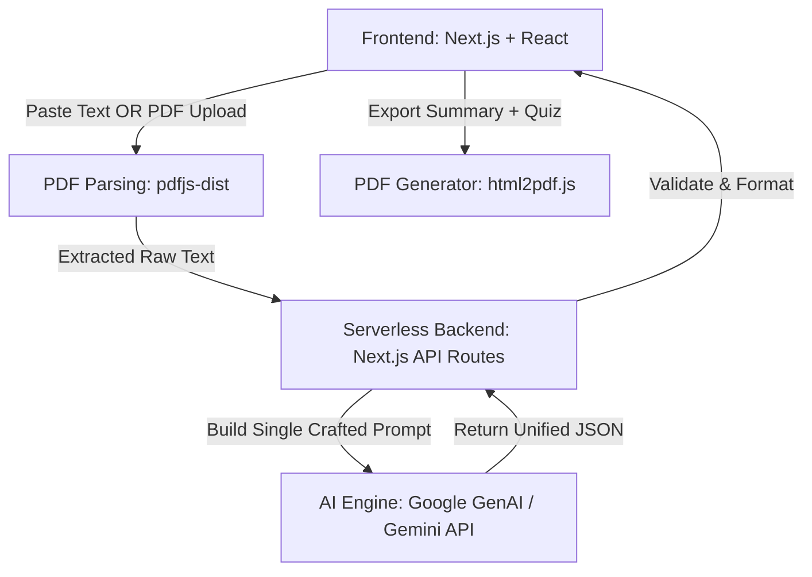
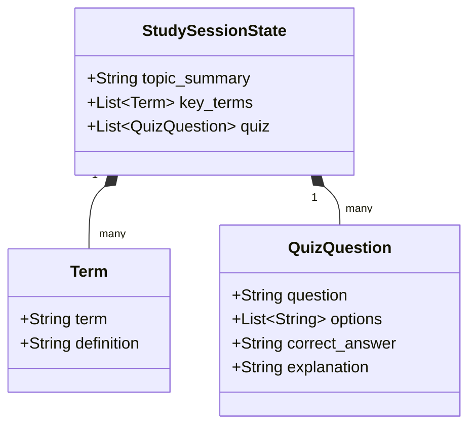

# AI-E01: AI-Powered Study Notes Summariser & Quiz Generator (Study Snap)

## Project Title & Team Details
**Project Name:** Study Snap  
**Team Name:** _[Insert Team Name Here]_
**Team Members:**  
1. Swayam Garg  
2. Yuvraj Pandiya  
3. Ajay Sahani  
4. Nikhil Singh Rajput  

## Problem Statement Overview
**Selected Problem:** AI-E01 (AI-Powered Study Notes Summariser & Quiz Generator)  
**Background:** Students across Indian colleges spend significant time manually creating revision notes and practice questions from lengthy lecture notes, textbooks, and PDFs. Most students report that summarisation and self-testing are the highest-impact study habits, yet both are extremely time-consuming.
**Core Solution Approach:**  
We built "Study Snap", a fast, zero-friction web application designed to save students hours of manual revision work. 
- **Instant Processing:** Students can paste raw lecture notes or upload PDF excerpts directly; no login is required, ensuring immediate access to learning tools.
- **Structured Summaries:** The AI instantly synthesizes the input into an organized, bullet-point summary broken down by topical headings.
- **Customizable Quizzes:** It generates a set of 5-10 multiple-choice questions (MCQs). Users can adjust the difficulty level (Easy/Medium/Hard) and the question count.
- **Active Recall Engine:** Extracts exact key terms and definitions from the text for quick memorization.
- **Offline Portability:** A robust client-side PDF export tool combines the generated summary and quiz into a clean, downloadable study guide for offline exam prep.

## Technical Architecture & Documentation (+3 Bonus Points Criteria)

### Architecture Diagram


### System Workflow/User Flow
*(Eraser Prompt)*
```eraser
// User Flow structure for Eraser.io

Student [icon: user] > "Lands on Study Snap" [icon: layout]
"Lands on Study Snap" > "Uploads PDF or Pastes Text" [icon: file-text]
"Uploads PDF or Pastes Text" > "Selects Difficulty (Easy/Med/Hard) & Q-Count" [icon: settings]
"Selects Difficulty (Easy/Med/Hard) & Q-Count" > "Backend formats prompt & calls Gemini API" [icon: cpu]

"Backend formats prompt & calls Gemini API" > "Receives Structured JSON Payload" [icon: code]
"Receives Structured JSON Payload" > "Renders Data on UI Dashboard" [icon: monitor]

"Renders Data on UI Dashboard" > "Views Topic Summary" [icon: list]
"Renders Data on UI Dashboard" > "Views Key Terms" [icon: tag]
"Renders Data on UI Dashboard" > "Takes Interactive Quiz" [icon: check-circle]

"Views Topic Summary" > "Clicks 'Download PDF'" [icon: download]
"Takes Interactive Quiz" > "Clicks 'Download PDF'"
"Clicks 'Download PDF'" > "html2pdf.js generates offline Revision Sheet" [icon: file-text]
```

## Setup and Installation Instructions

### Installation Steps
1. Clone the repository:
   ```bash
   git clone https://github.com/Swayam7Garg/Study-Snap.git
   cd Study-Snap
   ```
2. Install dependencies:
   ```bash
   npm install
   ```
3. Copy the environment template and insert your API credentials:
   ```bash
   cp .env.example .env
   ```
4. Start the development server:
   ```bash
   npm run dev
   ```

### Folder Structure Explanation
```bash
├── app/                  # Next.js App Router (Pages for routing & backend API)
│   ├── api/              # Serverless API endpoints (Gemini integration)
│   └── globals.css       # Tailwind configuration & global styles
├── components/           # Reusable UI React components (InputPanel, Quiz, DownloadButton)
├── lib/                  # Core utility functions (LLM logic, Prompt styling)
├── prompts/              # System prompt templates to guarantee JSON formatting
├── samples/              # Sample texts for testing the application
└── package.json          # Dependencies include Next.js, @google/genai, html2pdf.js
```

### Environment Variables
`.env.example`
```env
# Google AI API Key
GEMINI_API_KEY="AIzaSyYourKeyHere..."
NEXT_PUBLIC_GEMINI_API_KEY="AIzaSyYourKeyHere..."
```

## Live Demo & Assets

**Live Working Demo Link:**  
<!-- Insert Link Here (e.g. Vercel deployment) -->

**Screenshots/Screen Recording:**
<!-- Insert Demo Video / Screenshots Here -->


**Sample Test Inputs:**
- **Sample Text File:** Provided in `/samples/long.txt` (This contains textbook-level paragraphs on Cell Biology and the Mitochondria)
- **Configuration Params:** 
  - Difficulty: "Hard"
  - Question Count: "10"
- **Test Objective:** Verify that the system successfully returns exactly 10 questions styled for a difficult difficulty setting, complete with definitions.

## Domain-Specific Requirements

### Data State Schema (Stateless Architecture)
*Note: Because this application emphasizes privacy and is explicitly designed to "require no login," we opted for a highly performant **stateless** architecture. There is no traditional SQL database (ERD). Data is processed purely in memory and managed via client-side state. The structural schema defined dynamically via our unified AI JSON prompt is below:*



**Role-Based Access Logic:**
- **Anonymous Users (Students):** Have absolute zero-friction access to the full feature suite. They can parse text, generate quizzes, and export PDFs immediately. The service intentionally lacks 'Admins' or 'Premium' roles to maintain maximum accessibility for last-minute exam preppers.

## Technical Ethics & Transparency

### AI Usage Declaration
**Declaration:** 
- **Google Gemini API**: Utilized to process the core business logic (summarization, term extraction, MCQ generation). We specifically crafted a unified JSON system prompt to make exactly one API call for speed/cost efficiency rather than three separate ones.
- **GitHub Copilot / Cursor / ChatGPT**: Leveraged exclusively as pair-programming assistants to accelerate boilerplate React/Tailwind component styling and to quickly type-check our Next.js API routes with TypeScript schemas.

**Justification:** The core logic leverages Gemini because generating intelligent, context-aware MCQs and high-quality summaries from arbitrary unstructured text requires LLM-level semantic understanding. The usage is constrained dynamically to respond ONLY in JSON, preventing hallucinated conversational text from breaking the UI.

### Data Sources
1. **User Uploads (On-the-fly Data):** The app strictly processes user-provided inputs instantaneously.
2. **Synthetic / Public Textbooks:** During development, we used synthetic paragraphs and public domain Biology/History textbook equivalents (located in `/samples/`) to vigorously test the AI extraction accuracy and validate that the correct answers for MCQs matched the provided source text. 
3. **Data Retention:** We DO NOT store, log, or train on user study materials uploaded to the endpoints, prioritizing strict student privacy.
